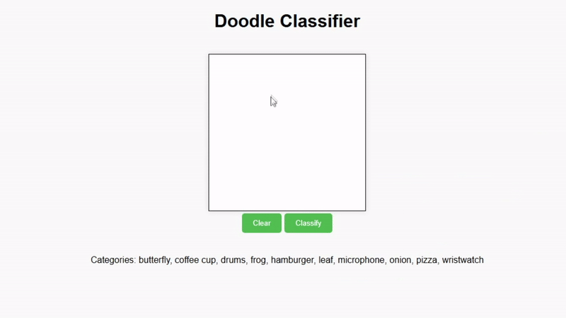

# Doodle Classifier

Interactive web application to classify user-drawn doodles into one of ten categories using a neural network.

## Table of Contents
- [Overview](#overview)
- [Features](#features)
- [Setup Instructions](#setup-instructions)
    - [Prerequisites](#prerequisites)
    - [Running the Application](#running-the-application)

## Overview

<div align="center">
  
  <p><em>Figure 1: Demonstration of the Doodle Classifier in action, showing how users can draw, classify, and clear their doodles.</em></p>
</div>


The Doodle Classifier is a Flask-based web application that enables users to draw doodles on a canvas and classify them into one of the following ten categories:
* butterfly, coffee cup, drums, frog, hamburger, leaf, microphone, onion, pizza, wristwatch

Using a pre-trained neural network, the application processes user-drawn images and identifies the most likely category. The user can clear the canvas or redraw for further experimentation.

## Features
- **Drawing Interface**: Users can freely draw in the browser-based square canvas.
- **Doodle Classification**: Classifies drawn images into one of the ten categories with a trained neural network.
- **Real-time Interactivity**: Quick feedback with the ability to clear the canvas and try again.

## Setup Instructions

### Prerequisites
To run this project, you need:
* Python 3.8+
* Recommended to use a virtual environment ()`venv`) to manage dependencies 

### Running the Application

1. Clone the repository:
```bash
git clone https://github.com/vulong2505/Doodle-Classifier.git
cd doodle-classifier
```

2. Install dependencies:
```bash
pip install -r requirements.txt
```

3. Start the application:
```bash
py app/server.py
```

4. In the terminal, open the ULR shown in the terminal (it might be http://127.0.0.1:5000/). Refer to the image below to find the link after starting the server.


